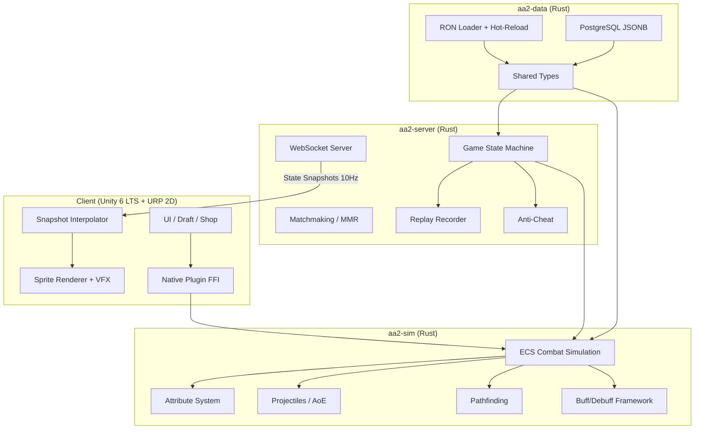

# AA2 Technical Architecture

## Overview

AA2 (Ability Arena 2) is a standalone cross-platform port of the Dota 2 mod Ability Arena — an 8-player free-for-all autobattler. Players pick gods, draft hero bodies (tiers 1–5), equip abilities (levels 1–9), and watch fully automated combat resolve with Dota 2-fidelity mechanics.

**Targets:** iOS (primary), Android, PC/Mac (Steam)  
**Art style:** 2D chibi/anime, top-down perspective  
**Engine:** Unity 6 LTS (presentation) + Rust (simulation)

---

## System Architecture

The system is a hybrid: a deterministic Rust simulation drives all game logic, while Unity handles rendering, UI, audio, and platform deployment.



### Layer Responsibilities

| Layer | Technology | Role |
|-------|-----------|------|
| Simulation | Rust (`aa2-sim`) | Deterministic ECS combat at 30Hz, f32 math, server-authoritative |
| Presentation | Unity 6 LTS, URP 2D | Sprites, VFX, UI, audio, platform builds |
| Server | Rust (`aa2-server`) | Headless sim, WebSocket, matchmaking, MMR, anti-cheat |
| Data | Rust (`aa2-data`) | Shared types, RON/JSON deserialization, validation |

The Rust sim compiles to a native library linked into Unity via C FFI (dev mode) and also compiles into the server binary (production).

---

## Crate Architecture

### `aa2-sim`

The core combat simulation. ECS-based (custom lightweight ECS, not bevy) running at 30 ticks/second.

**Responsibilities:**
- Entity management (heroes, projectiles, summons)
- Attribute system (STR/AGI/INT derived stats)
- Attack loop with BAT, attack speed, animation timing
- Ability casting (cast points, channels, targeting)
- Projectile system (homing, travel time)
- Buff/debuff framework (stacking rules, tick-based durations)
- Grid-based pathfinding with collision
- Targeting AI (aggro, priority, range checks)
- Turn rate and movement

**Compile targets:** `staticlib` (iOS), `cdylib` (Android/PC/Mac), server binary.

### `aa2-data`

Shared data definitions and loading.

**Responsibilities:**
- Type definitions: `Hero`, `Ability`, `God`, `Item`, `Buff`, `Projectile`
- `serde::Serialize` + `serde::Deserialize` on all types
- RON file loader with hot-reload via `notify` crate (dev)
- Validation (stat ranges, ability references, tier constraints)
- Same structs deserialize from RON (dev) and PostgreSQL JSONB (prod)

### `aa2-server`

Multiplayer game server.

**Responsibilities:**
- Game state machine (lobby → draft → combat rounds → results)
- WebSocket server (tokio + tungstenite)
- Matchmaking queue with MMR-based pairing
- Lobby management (8 players per game)
- Replay recording (snapshot stream → file)
- MMR calculation (placement, gain/loss per finish position)
- Anti-cheat validation (all mutations server-authoritative)
- Reconnection handling

---

## Networking Architecture

AA2 uses a **state-sync** model. The server is the single source of truth.

### Data Flow

```
Server (30Hz sim) → Snapshot (10Hz) → Delta Compress → WebSocket → Client → Interpolate → Render (60fps)
```

### Key Design Decisions

| Aspect | Approach |
|--------|----------|
| Sync model | State-sync (not lockstep) |
| Server tick | 30Hz (33.33ms) |
| Snapshot broadcast | 10Hz (every 3rd tick) |
| Client rendering | 60fps with interpolation between snapshots |
| Compression | Delta encoding — only changed fields per snapshot |
| Bandwidth | ~3–5 KB/s per client (own board only) |
| Spectating | Client can subscribe to any board on demand |
| Draft phase | Request/response over same WebSocket |
| Reconnect | Server sends full state snapshot; instant catch-up |

### Why State-Sync

Autobattlers have no player input during combat — there's nothing to "lock step" on. State-sync gives us:
- Trivial reconnection (send latest snapshot)
- Simple spectating (subscribe to a board)
- Server-authoritative anti-cheat by default
- No desync debugging

---

## Combat Simulation Details

### Tick Rate

30Hz (33.33ms per tick). Chosen to match Dota 2's server tick rate for mechanical fidelity while remaining cheap enough for mobile.

### Attribute System

| Attribute | Per Point | Derived Stats |
|-----------|-----------|---------------|
| STR | +22 HP, +0.1 HP regen/s | Health pool, sustain |
| AGI | +1 attack speed, +0.167 armor | DPS, survivability |
| INT | +12 mana, +0.05 mana regen/s | Ability usage |

### Core Formulas

**Attack speed interval:**
```
interval = BAT / (total_attack_speed / 100)
total_attack_speed = clamped(base + bonus, 20, 700)
```

**Armor damage multiplier:**
```
mult = 1 - (0.06 * armor) / (1 + 0.06 * |armor|)
```

### Combat Systems

- **Attack loop:** Acquire target → turn → wind-up (attack point) → launch projectile/apply damage → backswing
- **Projectiles:** Homing with configurable speed. Travel time = distance / speed. On-hit effects applied on arrival.
- **Abilities:** Cast point → effect → cooldown. Targeting modes: unit, point, no-target, passive.
- **Buffs/Debuffs:** Stack rules (refresh, independent, max stacks). Tick-based duration. Modifier priority system.
- **Pathfinding:** Grid-based A* with unit collision. Recalculates on obstruction.
- **Turn rate:** Units must face target before attacking/casting. Configurable degrees/second.

---

## Data Architecture

### Dual-Source Design

All game content is data-driven. The same Rust structs deserialize from two sources:

| Environment | Source | Format | Features |
|-------------|--------|--------|----------|
| Development | Local files | RON | Hot-reload, comments, human-readable |
| Production | PostgreSQL | JSONB | Queryable, versioned, admin-editable |

### Content Types

- **Gods** — passive/active abilities that define playstyle
- **Hero Bodies** — tiers 1–5, base stats, BAT, attack range, movement speed
- **Abilities** — levels 1–9, scaling values, targeting, cooldowns
- **Items** — stat bonuses, active effects, recipes

### Hot-Reload (Dev)

The `notify` crate watches RON files. On change:
1. File re-parsed and validated
2. Affected entities in the sim updated in-place
3. No restart required

---

## Dev Mode Architecture

A single developer can run the full game loop locally without a server.

- Sim runs in-process inside Unity (via FFI, same as production client)
- Developer controls all 8 player slots (draft, positioning)
- Hot-reload data files for instant balance iteration
- AI bots fill empty slots for testing combat
- Replay recording enabled for debugging combat sequences
- No network dependency — pure local execution

---

## Platform Deployment

| Platform | Unity Build | Rust Target | Linking |
|----------|-------------|-------------|---------|
| iOS | IPA (Xcode) | `aarch64-apple-ios` | Static lib (`.a`) |
| Android | APK/AAB | `aarch64-linux-android` | Shared lib (`.so`) |
| PC (Windows) | Standalone | `x86_64-pc-windows-msvc` | DLL |
| Mac | Standalone | `aarch64-apple-darwin` | dylib |
| Server | N/A | `aarch64-unknown-linux-gnu` | Binary |

Server deployment: containerized Rust binary on Linux (AWS/GCP), horizontally scalable per game instance.

---

## Replay System

### Recording

During combat, the server writes state snapshots to a replay buffer. At game end, the buffer is flushed to storage.

### Format

A replay is a sequence of timestamped state snapshots — the same format sent over WebSocket during live play.

### Playback

The replay viewer reuses the client's rendering and interpolation code. Instead of reading from a WebSocket, it reads from a file. Supports:
- Play/pause/seek
- Speed control (0.5x–4x)
- Board switching (view any player)

### Use Cases

- Post-game review
- Bug reproduction and debugging
- Content creation / streaming
- Spectating (live replays)

---

## Monetization Architecture

F2P freemium model. All gameplay-affecting content is earnable; monetization is cosmetic + progression.

| Revenue Stream | Platform Integration |
|----------------|---------------------|
| Battle Pass (seasonal) | Server-tracked progression |
| Cosmetics (direct purchase) | Skins, boards, effects |
| Apple IAP | StoreKit 2 |
| Google Play Billing | Billing Library v6+ |
| Steam Microtransactions | Steamworks API |

**Validation:** All purchases are validated server-side. The client sends a receipt; the server verifies with the platform's API before granting items. No client-trusted transactions.

---

## Security Model

- **Server-authoritative:** Clients send intents (draft picks, board positions). The server validates and applies.
- **No client simulation during multiplayer:** Clients only interpolate received state. Cannot fabricate game state.
- **Purchase validation:** Server-side receipt verification for all IAP.
- **Replay integrity:** Replays are server-recorded, not client-generated.

---

## Phase 2: Crate Structure

```
aa2/
├── crates/
│   ├── aa2-data/       # Shared types, RON loading (Phase 0) ✓
│   ├── aa2-sim/        # Combat simulation engine (Phase 0-1) ✓
│   ├── aa2-game/       # Game state machine, economy, draft (Phase 2) ← NEW
│   └── aa2-server/     # Networking, matchmaking, WebSocket (Phase 3)
├── client/             # Unity project (Phase 4)
└── data/               # RON data files
```

### aa2-game (NEW - Phase 2)
Owns the full game loop. Depends on aa2-sim and aa2-data.
- `PlayerState`: gold, HP, heroes, ability inventory, god, shop state
- `GameState`: 8 players, round counter, phase, ability pool, matchups
- `Economy`: gold calculation, shop upgrade costs with decay
- `Draft`: ability pool management, shop rolls, buy/sell/equip
- `RoundFlow`: state machine (GodPick → HeroDraft → Shop → Combat → Damage → repeat)
- `Matchmaker`: round-robin pairing with ghost opponents for odd counts
- `DamageCalc`: player damage formula
- `GodSystem`: god passive application, rule modifications

Key design: aa2-game is SHARED between client and server. This enables:
- Offline/dev mode (full game locally)
- Client-side prediction (optional)
- Server-side validation (authoritative)

### Dependency Graph
```
aa2-server → aa2-game → aa2-sim → aa2-data
                ↑
client (Unity) ─┘ (via FFI, for offline/replay)
```

## Client/Server Protocol

### State Sync (Server → Client)
- During combat: state snapshots at 10Hz (unit positions, HP, buffs, events)
- During shop: PlayerState updates on change (gold, inventory, shop contents)
- Public info: other players' HP, hero count (not ability details)

### Actions (Client → Server)
All player actions are request/response over WebSocket:
```
BuyAbility(slot) → Ok/Err(reason)
SellAbility(id) → Ok/Err
RerollShop → Ok(new_choices)/Err
UpgradeShop → Ok/Err
EquipAbility(ability_id, hero_idx, slot_idx) → Ok/Err
UnequipAbility(hero_idx, slot_idx) → Ok/Err
PickGod(god_id) → Ok/Err
PickHeroBody(idx) → Ok/Err
RerollHeroBody → Ok(new_choices)/Err
PlaceHero(hero_idx, x, y) → Ok/Err
Ready → Ok
```

Server validates all actions against game rules. Invalid actions rejected with reason.

### Reconnect
Server sends full GameState snapshot. Client rebuilds from scratch.